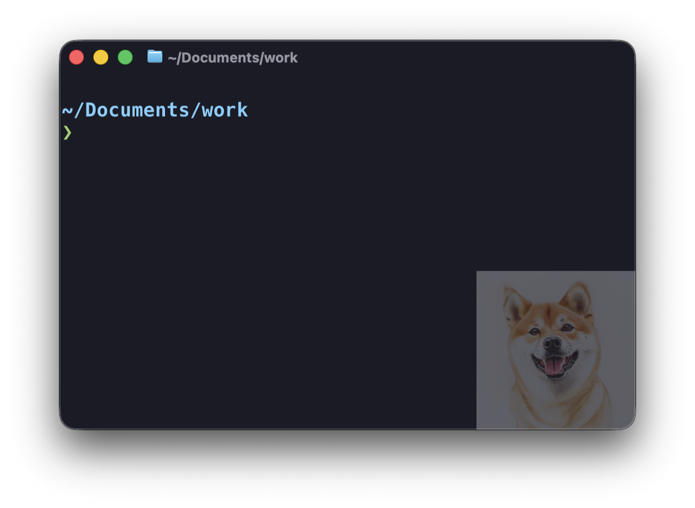

# dogtty

English | [日本語](README.ja.md)

Shows an AI-generated shiba inu in the bottom-right corner of your Ghostty
terminal, and swaps it for a new one every 3 minutes.



Built as a small ADHD aid: a bit of comfort and visual variety in the
terminal you stare at all day.

## How it works

```
launchd (every 180s)
  → dogtty
      1. Generate a shiba inu image with Pollinations.ai (free, no API key)
      2. Convert it to a 300px PNG and overwrite ~/.local/share/dogtty/dogtty.png
      3. Send SIGUSR2 to Ghostty to reload its config → the corner dog changes
```

6 poses × 6 styles (watercolor, pastel, flat illustration, colored pencil,
DSLR photo, film photo) × random seed — a different shiba every time.

## Files

The tool is the single `dogtty` script: generation plus the `install` /
`config` / `uninstall` subcommands. It is fully self-contained (it even
generates its own launchd plist), so downloading that one file is enough.

## Setup

```bash
./dogtty install        # asks for the dog, the look and the interval interactively
./dogtty install 600    # non-interactive: interval as an argument (min 60), defaults otherwise
```

The dog picker offers shiba inu (default), shih tzu, corgi, toy poodle,
golden retriever, or a free-form prompt (which doesn't even have to be a
dog). The look picker offers mixed (default), illustration only, photo
only, or a free-form style (e.g. pixel art). Choices are stored under
`~/.config/dogtty/`.

Then add the following to your Ghostty config (`~/.config/ghostty/config`)
and reload with `Cmd+Shift+,`:

```ini
background-image = ~/.local/share/dogtty/dogtty.png
background-image-position = bottom-right
background-image-fit = none
background-image-opacity = 0.3
```

## Usage

```bash
dogtty                                  # generate a random shiba now
dogtty "corgi puppy, pixel art"         # generate with your own prompt
dogtty config                           # change the dog, look and interval interactively
dogtty config 600                       # set only the interval directly (seconds, min 60)
dogtty install [seconds]                # (re)install
dogtty uninstall                        # remove everything
```

(`install`, `uninstall` and `config` are reserved words and can't be used
as generation prompts.)

## Operations

```bash
# Stop the automatic runs
launchctl bootout gui/$(id -u)/local.dogtty

# Resume the automatic runs
launchctl bootstrap gui/$(id -u) ~/Library/LaunchAgents/local.dogtty.plist

# View logs (auto-truncated when it exceeds 1MB)
cat ~/Library/Logs/dogtty.log
```

To change the dog, the look or the interval after install, run
`dogtty config` (interactive) or `dogtty config 600` (interval only).
Re-running `./dogtty install` works too.

When Ghostty is not running, dogtty skips generation entirely (no wasted
API calls).

## Uninstall

```bash
dogtty uninstall
```

The 4 `background-image` lines added to your Ghostty config must be removed
manually.

## Notes

- **Do not symlink `~/.local/bin/dogtty` into this repository.** If the repo
  lives under a TCC-protected folder such as `~/Documents`, launchd cannot
  read through the symlink and fails with "Operation not permitted". A real
  copy is required — `dogtty install` does exactly that (re-run it after
  editing the script)
- **Never send Ghostty any signal other than SIGUSR2.** Unhandled signals
  kill the process. Config reload via SIGUSR2 is officially supported since
  Ghostty 1.2
- Anonymous Pollinations.ai usage is rate-limited: rapid requests get
  HTTP 429, so the script retries up to 3 times with a 15-second wait
- Generated images are AI output, free of copyright concerns

## Requirements

- macOS (`sips`, `launchd`, and `python3` are all stock macOS tools)
- Ghostty 1.2+ (`background-image` and SIGUSR2 reload required; tested on 1.3.1)

## License

MIT
